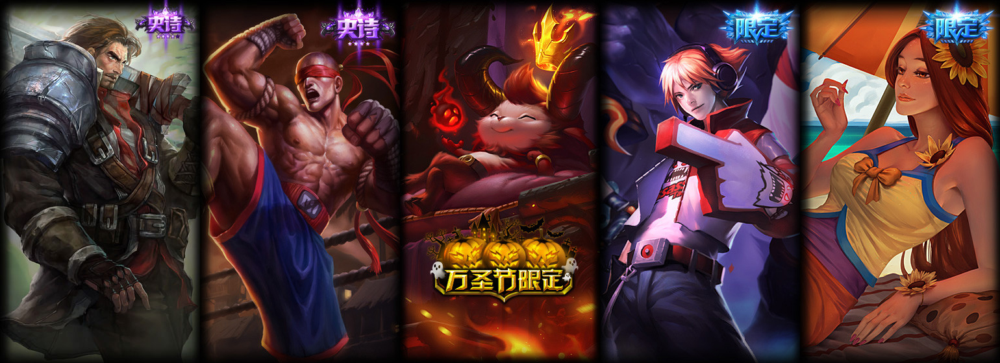

## Introduction

This script aims to download LOL hero skins from [official website](https://lol.qq.com/data/info-heros.shtml).

## Usage

1. Download and install [Python 3+](https://www.python.org/downloads/)

2. Install requests: `pip install requests`

3. Run the script: `python skins.py`

## Assets

[Big images](https://game.gtimg.cn/images/lol/act/img/skin/big134002.jpg), [loading images](https://game.gtimg.cn/images/lol/act/img/skinloading/122002.jpg), [pick](https://game.gtimg.cn/images/lol/act/img/vo/choose/17.ogg)/[ban](https://game.gtimg.cn/images/lol/act/img/vo/ban/17.ogg) audio will be downloaded.

